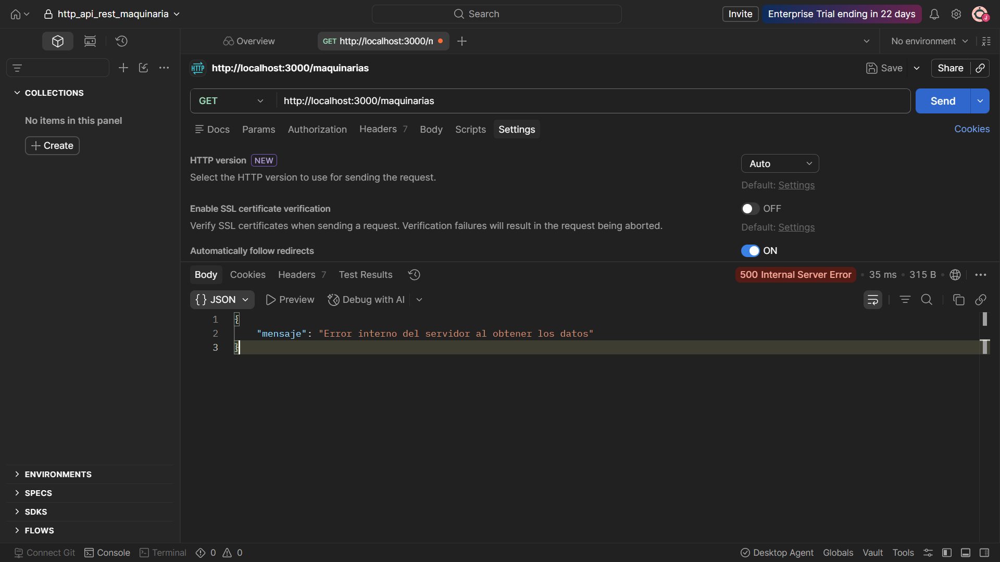
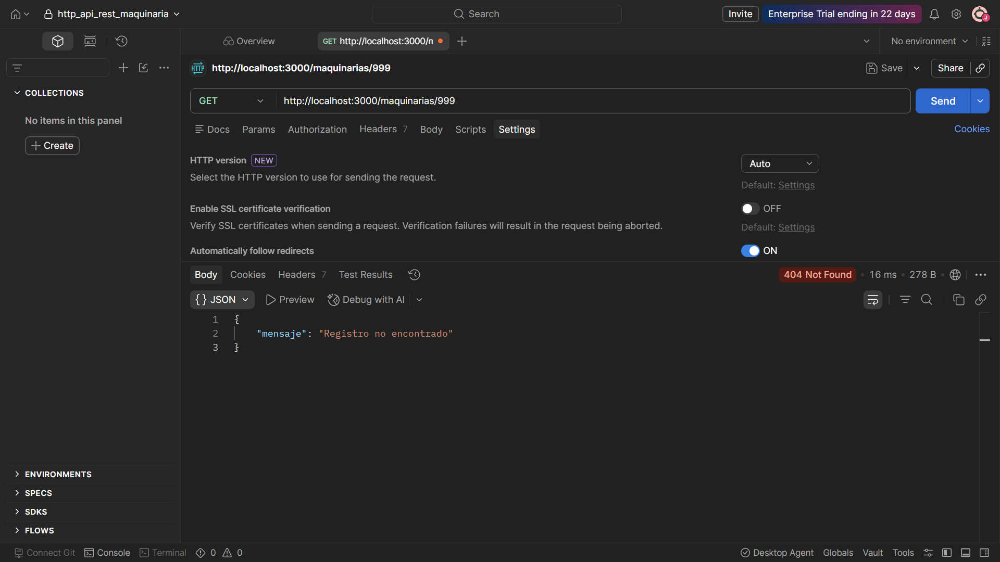
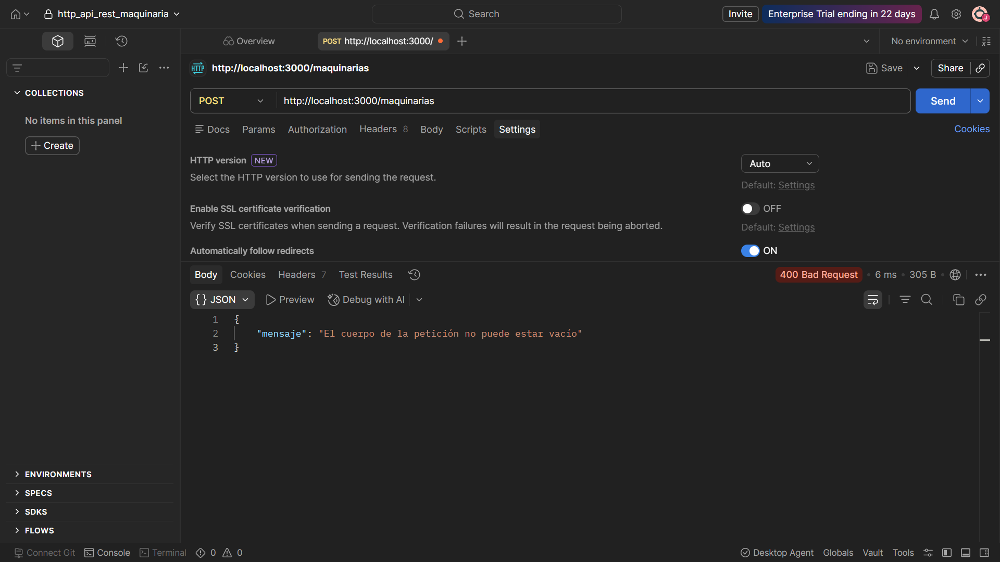
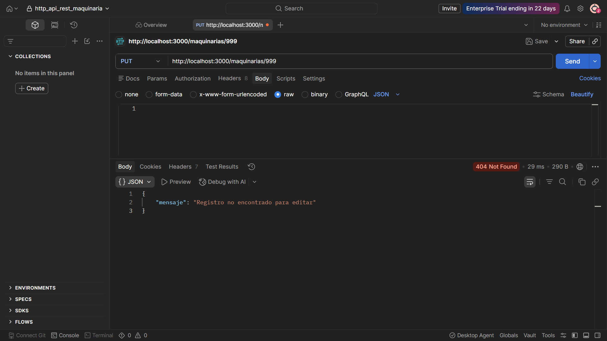
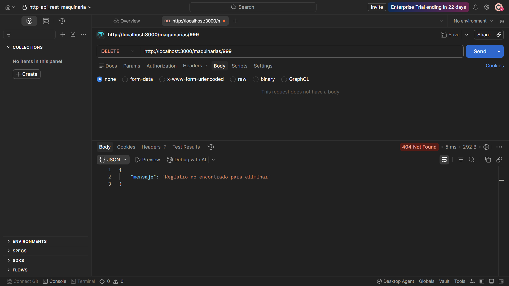

# Actividad AE-6: Manejo de Errores y Códigos HTTP en API REST

Este proyecto consiste en una API REST desarrollada en Node.js con Express para la gestión de registros de maquinarias, guardados de forma persistente en un archivo `data.json`. En esta versión se ha implementado un control robusto de errores mediante bloques `try...catch` y validaciones `if...else`, asegurando el retorno de los códigos de estado HTTP correctos para cada escenario.

## Requisitos Previos

- Node.js instalado
- Postman (o cualquier cliente HTTP) para realizar las pruebas

## Instalación y Ejecución

1. Clonar el repositorio.
2. Instalar las dependencias ejecutando en la terminal:

```bash
   npm install
```

| Método  | Ruta           | Descripción                                                                |
| :------ | :------------- | :------------------------------------------------------------------------- |
| **GET** | `/maquinarias` | Error 500 solicitando la lista completa de maquinarias en el archivo JSON. |



| **GET** | `/maquinarias/:id` | Error interno y con un ID inexistente. |



| **POST** | `/maquinarias` | Error al agregar un registro vacio al JSON. Peticion vacia. |


| **PUT** | `/maquinarias/:id` | Error al modificar un registro inexistente. |


| **DELETE** | `/maquinarias/:id` | Error al intentar eliminar un registro inexistente. |

